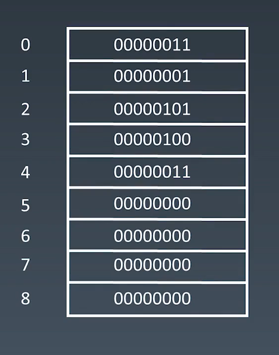
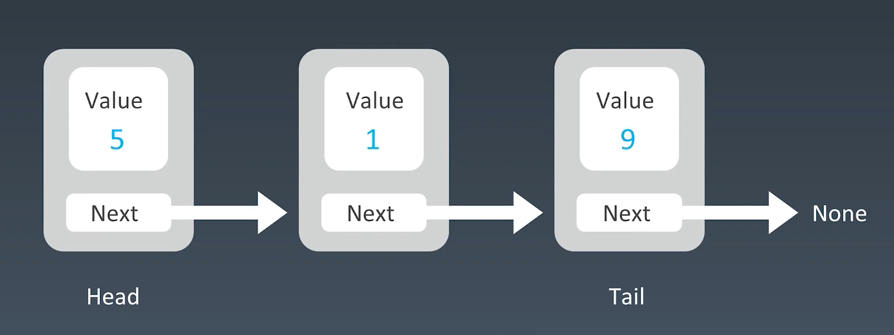
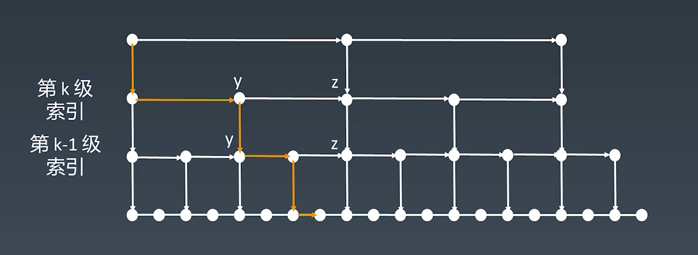
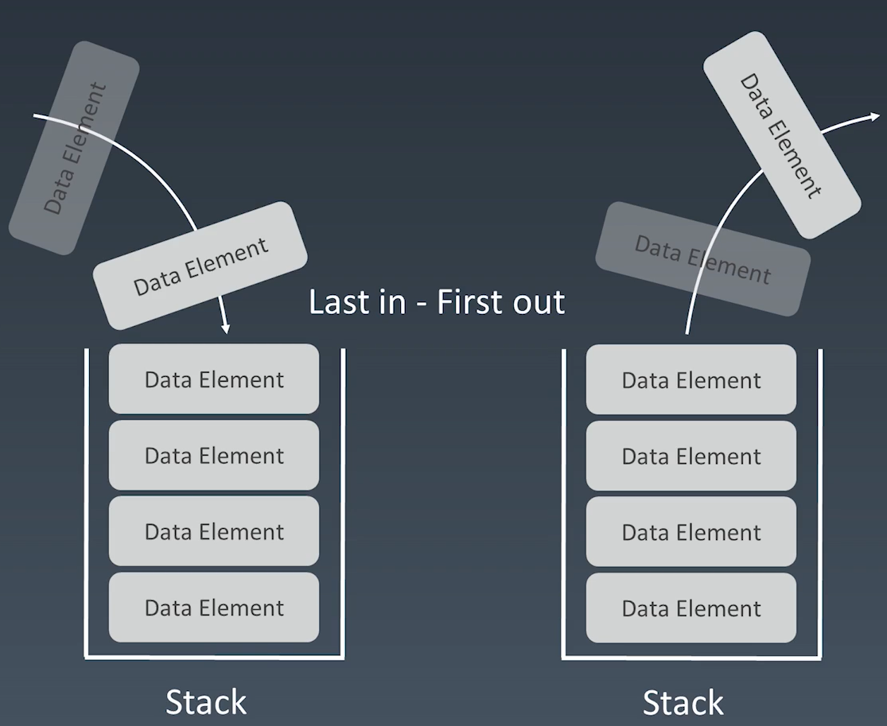
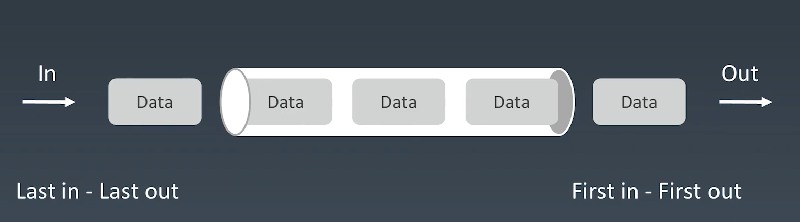
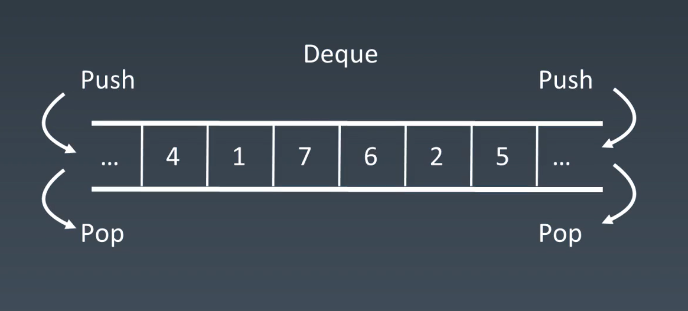

# 第一周学习笔记

## 数组

```ts
interface Array<T> {
    [index: number]: T
}
```



数组是内存中一段连续的地址空间。

### 时间复杂度

| 操作    | 时间复杂度 |
| ------- | ---------- |
| prepend | O(n)       |
| append  | O(1)       |
| lookup  | O(1)       |
| insert  | O(n)       |
| delete  | O(n)       |

> prepend 可以通过预留前置空间，从而优化到 O(1) 


## 链表

```ts
interface LinkedList<T> {
    value: T
    next: LinkedList
}
```



适应于频繁的修改/删除/添加等操作；查询操作效率低

### 时间复杂度

| 操作   | 时间复杂度 |
| ------ | ---------- |
| lookup | O(n)       |
| insert | O(1)       |
| delete | O(1)       |

### 应用

- LRU Cache (双向链表)

## 跳表

1. 跳表是基于有序链表的
2. 跳表对标平衡树和二分查找
3. 通过升维即增加多级索引加速查询效率



相对与平衡树来说，原理简单，容易实现，方便扩展。适用于数据量不是很大的情况；每次增加,删除操作都需要更新索引

### 时间复杂度

| 操作   | 时间复杂度 |
| ------ | ---------- |
| lookup | O(log n)   |
| insert | O(log n)   |
| delete | O(log n)   |

### 应用

- redis

## 栈



## 队列



## 双端队列



## 优先队列

按照元素优先级取出

底层实现：heap bst treap

### 时间复杂度

| 操作    | 时间复杂度 |
| ------- | ---------- |
| insert  | O(1)       |
| takeout | O(log n)   |

# 参考连接

[ArrayList JAVA 源码分析](http://developer.classpath.org/doc/java/util/ArrayList-source.html)

[Linked List 的标准实现代码](http://www.geeksforgeeks.org/implementing-a-linked-list-in-java-using-class/)

[Linked List 示例代码](http://www.cs.cmu.edu/~adamchik/15-121/lectures/Linked%20Lists/code/LinkedList.java)

[Java 源码分析（LinkedList）](http://developer.classpath.org/doc/java/util/LinkedList-source.html)

[LRU 缓存机制](http://leetcode-cn.com/problems/lru-cache)

[跳跃表、为啥 Redis 使用跳表（Skip List）而不是使用 Red-Black？](http://www.zhihu.com/question/20202931)

[Java 的 PriorityQueue 文档](http://docs.oracle.com/javase/10/docs/api/java/util/PriorityQueue.html)

[Java 的 Stack 源码](http://developer.classpath.org/doc/java/util/Stack-source.html)

[Java 的 Queue 源码](http://fuseyism.com/classpath/doc/java/util/Queue-source.html)

[Python 的 heapq](http://docs.python.org/2/library/heapq.html)

[高性能的 container 库](http://docs.python.org/2/library/collections.html)

Array 实战题目

[盛最多水的容器（腾讯、百度、字节跳动在近半年内面试常考）](https://leetcode-cn.com/problems/container-with-most-water/)

[移动零（华为、字节跳动在近半年内面试常考）](https://leetcode-cn.com/problems/move-zeroes/)

[爬楼梯（阿里巴巴、腾讯、字节跳动在半年内面试常考）](https://leetcode.com/problems/climbing-stairs/)

[三数之和（国内、国际大厂历年面试高频老题）](https://leetcode-cn.com/problems/3sum/)

Linked List 实战题目

[反转链表（字节跳动、亚马逊在半年内面试常考）](https://leetcode.com/problems/reverse-linked-list/)

[两两交换链表中的节点（阿里巴巴、字节跳动在半年内面试常考）](https://leetcode.com/problems/swap-nodes-in-pairs)

[环形链表（阿里巴巴、字节跳动、腾讯在半年内面试常考）](https://leetcode.com/problems/linked-list-cycle)

[环形链表 II](https://leetcode.com/problems/linked-list-cycle-ii)

[K 个一组翻转链表（字节跳动、猿辅导在半年内面试常考）](https://leetcode.com/problems/reverse-nodes-in-k-group/)

Stack / Queue 实战题目

[有效的括号（亚马逊、JPMorgan 在半年内面试常考）](https://leetcode-cn.com/problems/valid-parentheses/)

[最小栈（亚马逊在半年内面试常考）](https://leetcode-cn.com/problems/min-stack/)

[柱状图中最大的矩形（亚马逊、微软、字节跳动在半年内面试中考过）](https://leetcode-cn.com/problems/largest-rectangle-in-histogram)

[滑动窗口最大值（亚马逊在半年内面试常考）](https://leetcode-cn.com/problems/sliding-window-maximum)

[接雨水（亚马逊、字节跳动、高盛集团、Facebook 在半年内面试常考）](https://leetcode.com/problems/trapping-rain-water/)